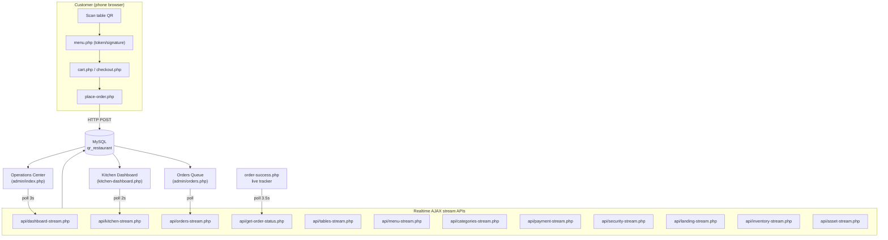
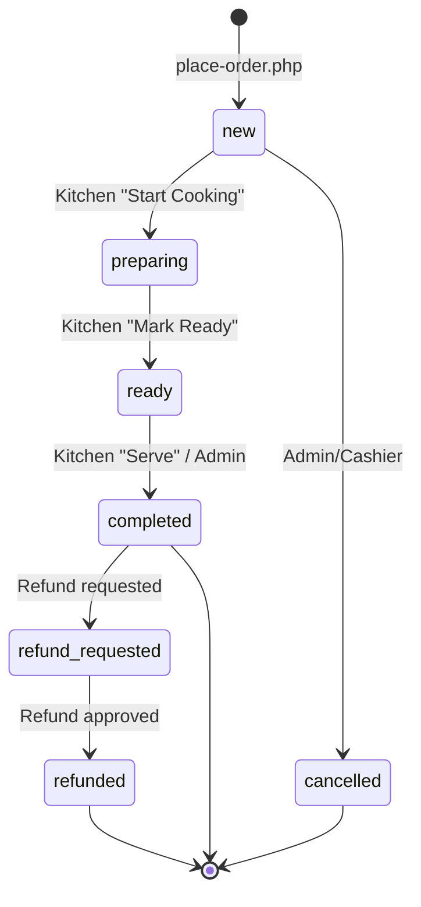
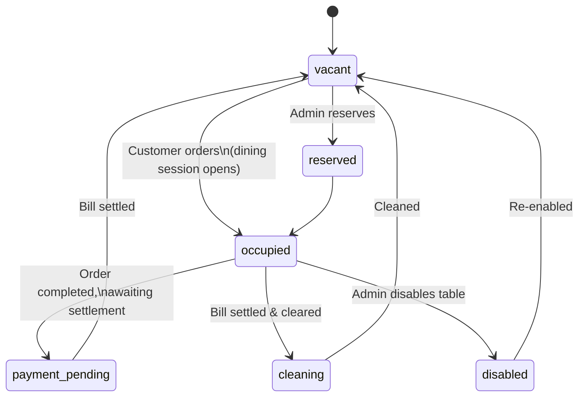
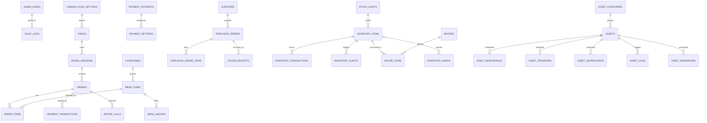

# QR Cafe POS — Restaurant Management System

> A complete, self-hosted restaurant management platform that turns a printed QR code into a full digital ordering experience — from table-side menu browsing and live kitchen tickets to inventory control and asset tracking.

[](https://www.php.net/)
[](https://www.mysql.com/)
[](https://developer.mozilla.org/en-US/docs/Web/JavaScript)
[](https://tailwindcss.com/)
[](https://httpd.apache.org/)
[](#known-limitations)
[](https://github.com/Wearing-wind/RMS_System)

---

## Table of Contents

- [Project Status](#project-status)
- [Project Overview](#project-overview)
- [Problem → Solution](#problem--solution)
- [Key Features](#key-features)
- [Module Map](#module-map)
- [Roles & Permissions](#roles--permissions)
- [Architecture Overview](#architecture-overview)
- [Tech Stack](#tech-stack)
- [Project Structure](#project-structure)
- [Database Architecture](#database-architecture)
- [Payments](#payments)
- [Security](#security)
- [Realtime Updates](#realtime-updates)
- [Installation & Setup](#installation--setup)
- [Environment Variables](#environment-variables)
- [Local Development](#local-development)
- [API Reference](#api-reference)
- [Testing & QA Status](#testing--qa-status)
- [Known Limitations](#known-limitations)
- [Roadmap](#roadmap)
- [Deployment](#deployment)
- [Contributing](#contributing)
- [License](#license)
- [Author](#author)
- [Support](#support)

---

## Project Status

| Aspect | Status |
| --- | --- |
| **Codebase** | Production-oriented, actively developed |
| **Version** | `v2.0.0-Pro` (per project documentation — **not** verifiable from code alone) |
| **License** | Not specified in this repository (no `LICENSE` file) — see [License](#license) |
| **Testing** | Documented QA run: 42/42 PASS; security audit: 38/38 resolved (self-reported in `QA_REPORT.md` / `SECURITY_AUDIT.md`) |
| **Known gaps** | See [Known Limitations](#known-limitations) |

---

## Project Overview

**QR Cafe POS** is a single-codebase restaurant management system for restaurants, cafes, and QSRs. Customers scan a QR code on their table to open the menu in their phone browser, place an order, and track it live until it reaches their table. Staff manage the floor through a realtime **Operations Center**, the kitchen through a dedicated **Kitchen Display System (KDS)**, and back-office teams control inventory, suppliers, purchase orders, and physical assets — all from one Apache/PHP + MySQL deployment with **no build step and no external services**.

It was designed to run on shared hosting / XAMPP, uses vanilla JavaScript with AJAX polling for realtime updates (no WebSockets required), and ships with an SQL schema that the application can create automatically at boot.

---

## Problem → Solution

| Problem | Solution in this system |
| --- | --- |
| Traditional paper menus are static, cost money to reprint, and give no data | Dynamic digital menu served by QR token per table, with live availability toggles |
| Customers don't know order progress | Per-order live tracker on the confirmation page (polling every ~3.5s) |
| Waiters run between kitchen and floor | Kitchen Display System (KDS) with 2s polling and status buttons |
| Manual order entries cause price/arithmetic errors | Server-side pricing computed from the database, never from the client |
| Inventory goes wrong silently | Full inventory module: items, categories, suppliers, purchase orders, goods receiving, stock adjustments, waste, recipes, alerts |
| Equipment/asset tracking is lost in spreadsheets | Asset module: register, maintenance, warranty, transfers/assignments, depreciation, QR labels |
| Table-hopping / IDOR attacks on order endpoints | QR token + HMAC signed URLs + session table pinning |
| Online payment providers need certifications & webhooks | Offline-first payment flow: customer scans a merchant QR (eSewa/Khalti) or pays cash at the table |

---

## Key Features

### Customer Experience
- **QR table menu** — scan-to-menu with per-table signed URLs; table disabled state blocks ordering
- **Mobile-first menu** — category sections, item addons, quantity selection, stock-status badges
- **Order tracking** — live progress (new → preparing → ready → served) with step UI
- **Settlement options** — "Cash at Table" and "Digital Scan & Pay (eSewa / Khalti)" unlocked once the order is served
- **Waiter call** — request staff from the order screen

### Kitchen Display (KDS)
- Dedicated `kitchen-dashboard.php` with 2s live polling
- KPI cards (Preparing / Ready counts), per-order cards, filter tabs
- One-tap status transitions: **Start Cooking → Mark Ready → Serve**
- Kitchen menu with quick stock toggles (`active` / `sold_out`)
- Sound/visual alert on new orders

### Admin (Manager Console)
- **Operations Center** — realtime KPI dashboard: today's revenue, orders, average order value, live orders feed, payment-method breakdown, low-stock alerts, activity feed, global search (polling every 3s)
- **Floor & Tables** — table CRUD, capacity, status lifecycle, QR code generation & printing
- **Orders Queue** — all orders, filtering, status transitions, refunds, per-order details
- **Menu Catalog** — menu item CRUD, pricing, addons, category, tags, availability
- **Landing Site** — 6-tab customizer for the public landing page content
- **Security & IAM** — admin + KDS password management, user role listing

### Inventory Management
- Inventory dashboard, stock items with barcode/QR, inventory categories, units, suppliers
- Purchase orders (approve/receive), goods receiving, stock movements
- Stock adjustments, stock audits, waste management, recipe-based item recipes
- Low-stock alerts + inventory reports

### Asset Management
- Asset dashboard, asset register, categories
- Maintenance schedules, warranty tracking, transfers/assignments
- Depreciation, QR labels for assets, reports

### Platform
- Realtime via AJAX polling (no SSE/WebSockets needed)
- Auto-provisioned database schema on first run
- HMAC-signed table URLs + QR tokens
- Security headers, CSRF protection, rate limiting, session hardening
- PWA manifest (installable; **offline support limited** — no service worker)

---

## Module Map

### Public (no login)

| Route | Purpose |
| --- | --- |
| `index.php` | Landing page (content editable from admin) |
| `menu.php?token=…` | Digital menu behind a per-table QR token (primary) |
| `menu.php?table=…&sig=…` | Legacy HMAC-signed menu URL (backwards compatible) |
| `cart.php` / `checkout.php` | Cart + checkout (payment settled later, see [Payments](#payments)) |
| `place-order.php` | Server-side order creation (rate-limited, idempotent) |
| `order-success.php` | Order tracker + settlement + waiter call |

### Kitchen Display System (KDS password)

| Route | Purpose |
| --- | --- |
| `kitchen-dashboard.php` | Live kitchen ticket wall with status buttons |
| `kitchen-menu.php` | Kitchen-side menu with quick stock toggles |

### Admin Console (login required)

| Area | Pages |
| --- | --- |
| Operations Center | `index.php` |
| Floor & Tables | `tables.php` |
| Orders | `orders.php`, `order-details.php` |
| Menu | `menu-items.php`, `categories.php` |
| Landing Site | `landing-page.php` |
| Payment Configuration | `payment-settings.php` |
| Inventory | `inventory.php`, `inventory-items.php`, `inventory-categories.php`, `suppliers.php`, `purchase-orders.php`, `goods-receiving.php`, `stock-movements.php`, `stock-audit.php`, `waste.php`, `recipes.php`, `inventory-reports.php` |
| Assets | `asset-dashboard.php`, `assets.php`, `asset-categories.php`, `asset-maintenance.php`, `asset-warranty.php`, `asset-transfers.php`, `asset-depreciation.php`, `asset-qr.php`, `asset-reports.php` |
| Security & IAM | `change-password.php` |

*Full admin page inventory verified via `admin/` glob — 32 application pages + 2 `includes/` (`header.php`, `sidebar.php`). All admin pages are role-gated via shared `admin/includes/sidebar.php` and `Auth` guards.*

---

## Roles & Permissions

Access control lives in `helpers/Inventory.php` (permission map) and the shared sidebar gate. Authentication is stored in `admin_users` with a `role` column.

| Role | Capabilities |
| --- | --- |
| `admin` | Everything, including Security & IAM, users, settings |
| `manager` | Operations + most back-office modules (read/write), no user management |
| `owner` | Treated as admin/manager-equivalent in sidebar gating |
| `store_keeper` | Inventory, categories, suppliers, purchase orders, receiving, stock movements, adjustments, alerts |
| `kitchen` | Recipes, waste, kitchen operations |
| `cashier` | Limited read operations |
| `auditor` | Read-only across modules |

Permission enforcement (from `Inventory.php` `can_write` map):

| Module | admin | manager | store_keeper | kitchen | cashier | auditor |
| --- | :-: | :-: | :-: | :-: | :-: | :-: |
| Inventory / Categories / Suppliers / POs / Receiving / Movements / Alerts / Assets | ✅ | ✅ | ✅ | ❌ | ❌ | 👁️ |
| Recipes / Waste | ✅ | ✅ | ✅ | ✅ | ❌ | 👁️ |
| Maintenance / Transfers / Depreciation | ✅ | ✅ | ❌ | ❌ | ❌ | 👁️ |
| Reports | ✅ | ✅ | ✅ | ❌ | ❌ | 👁️ |
| Users / IAM / Settings | ✅ | ❌ | ❌ | ❌ | ❌ | ❌ |

**Authentication model**
- **Admin/staff**: `admin_users` table, bcrypt password, session-based, role stored in session.
- **Kitchen (KDS)**: separate password gate (stored in landing settings; default documented as `kitchen123` — change it in production).
- **Customer**: no login — authenticated via the table's QR token bound to the session (`customer_table_id`), which also guards order lookups against IDOR.

---

## Architecture Overview



> **Realtime model:** lightweight AJAX **polling** with exponential backoff — no WebSockets, no server-sent events, no external services. This keeps the system deployable on plain Apache/shared hosting. See [Realtime Updates](#realtime-updates).

### Order lifecycle



Enforced by `OrderService::$allowedTransitions` with row-locked (`FOR UPDATE`) transactions.

### Table lifecycle



---

## Tech Stack

| Layer | Technology | Notes |
| --- | --- | --- |
| Language | **PHP 8.1+** | Native PHP, no Composer dependencies |
| Database | **MySQL 8.0+** / MariaDB | Schema auto-created at boot |
| Frontend | **Vanilla JavaScript** + **Tailwind CSS v3.4** (CDN) | No framework; dark amber/zinc UI |
| Realtime | **AJAX polling** | Backoff-based, per-screen intervals |
| Server | **Apache 2.4** | `.htaccess`-based routing, security headers |
| PWA | **manifest.json** | Installable standalone app (see limitations) |
| Build tools | None | No `composer.json`, `package.json`, or bundler |

---

## Project Structure

```text
RMS_System/
├── .htaccess                  # Routing, security headers, caching, protected files
├── .env.example               # Environment template (copy to .env)
├── config.php                 # Boot: env loader, DB, schema auto-create, auth, helpers
├── database.sql               # Manual schema import + seed data
├── database/
│   └── migrations/            # Incremental SQL migrations (001-003)
├── helpers/                   # Auth, Security, CSRF, RateLimiter, Response,
│                              # Inventory (RBAC), OrderService (state machine)
├── app/Services/LoggerService.php
├── api/                       # All JSON endpoints + realtime streams
├── admin/                     # Manager console (32 pages + 2 includes)
├── kitchen-dashboard.php      # KDS (separate auth)
├── kitchen-menu.php
├── index.php                  # Landing page
├── menu.php                   # QR digital menu
├── cart.php / checkout.php / place-order.php
├── order-success.php          # Live tracker + settlement
├── images/                    # Branding, hero, payment QR uploads
├── js/                        # Shared client-side logic
├── storage/                   # Logs & backups (gitignored)
└── QA / SECURITY docs         # QA_REPORT.md, SECURITY_AUDIT.md, etc.
```

---

## Database Architecture

The database is created/upgraded automatically by `config.php` on first run (`ensureDatabaseSchema`). Default database name: `qr_restaurant` (override via `.env`).



**Core tables (~35):**

| Domain | Tables |
| --- | --- |
| Identity | `admin_users`, `user_sessions` |
| Menu | `categories`, `menu_items`, `menu_addons` |
| Floor | `tables`, `dining_sessions` |
| Orders | `orders`, `order_items`, `waiter_calls` |
| Payments | `payment_gateways`, `payment_settings`, `payment_transactions` |
| Content | `landing_page_settings` |
| Audit | `audit_logs` |
| Inventory | `inventory_categories`, `inventory_units`, `inventory_items`, `suppliers`, `purchase_orders`, `purchase_order_items`, `goods_receipts`, `inventory_transactions`, `recipes`, `recipe_items`, `inventory_waste`, `stock_audits`, `inventory_alerts` |
| Assets | `asset_categories`, `assets`, `asset_maintenance`, `asset_transfers`, `asset_depreciation`, `asset_logs`, `asset_warranties` |

**Seed data** (`database.sql`): default admin user, 10 tables (1–10), 5 categories, sample menu items with NPR pricing, default payment settings.

> ⚠️ **Default credentials warning:** the legacy seed file ships an admin user whose documented password is `admin123`. The runtime bootstrap (`config.php`) instead creates/verifies the admin using `APP_ADMIN_PASSWORD` from `.env` (or a randomly generated password logged to `error_log`). **Always set a strong `APP_ADMIN_PASSWORD` in production.**

---

## Payments

> **Important:** This system is **offline-first** for payments. It does **not** process real online transactions, has **no** gateway webhooks/callbacks/IPN, and does **not** call external payment APIs.

### How it works

1. Customer places an order → `payment_status = 'pending'`, `payment_method` recorded.
2. Order must reach `completed` (served) before settlement options unlock on `order-success.php`.
3. Customer settles via:
   - **Cash at Table** (paid to staff), or
   - **Digital Scan & Pay** — scans the merchant QR image (eSewa / Khalti) uploaded by the admin.
4. Staff mark the order paid in the admin console; payment method allowlist: `cash, card, esewa, khalti, fonepay, connectips, imepay`.

### Gateway configuration

`admin/payment-settings.php` lets admins configure **eSewa, Khalti, Fonepay, ConnectIPS, and IME Pay** (seeded with sandbox test credentials in `payment_gateways`). **These are configuration records only** — no live payment calls are made. The "Test API" button in payment settings is a stub that only reports a success message (it does not contact the gateway).

### Dashboard payment breakdown keys

`cash, esewa, khalti, fonepay, connectips, ime_pay, card, other` (as returned by `dashboard-stream.php`).

---

## Security

Implemented and verified in code:

| Control | Where |
| --- | --- |
| Bcrypt password hashing (`password_hash`/`password_verify`) | `Auth` helper + `admin/login-process.php` |
| CSRF tokens on state-changing requests | `CSRF` helper (`requireValidToken`) |
| Session hardening — `HttpOnly`, `SameSite=Lax`, `Secure` on HTTPS, `session_regenerate_id` on login, 7200s idle timeout | `Auth::startSession` |
| Rate limiting — admin login `5 / 5 min`, `place-order` `10 / min` | `RateLimiter` helper |
| Security headers — CSP, X-Frame-Options, nosniff, Referrer-Policy, Permissions-Policy, HSTS (HTTPS) | `Security` helper + `.htaccess` |
| Per-table QR auth — 32-hex token (primary) + HMAC-SHA256 signed URL (legacy) | `config.php` table-token helpers |
| Session table pinning / IDOR guards on order lookups | `api/get-order-status.php`, `order-success.php` |
| Server-side pricing — totals recomputed in DB, never trusted from client | `place-order.php` |
| Idempotency keys to prevent duplicate orders | `place-order.php` |
| Row-locked (`FOR UPDATE`) transactions for order status changes | `OrderService` |
| Immutable inventory transaction log + alert dedup | `Inventory` helper |
| Upload validation — MIME allowlist (`jpg/png/webp`), ≤2MB, random names, SVG rejected | inventory/asset uploads |
| Protected files — `.htaccess` denies `config.php`, `database.sql`, `.env`; directory listing off | `.htaccess` |
| Audit trail | `audit_logs` + `LoggerService` |

### Known security notes (be transparent)

- **Not 100% prepared statements everywhere** — some queries (e.g. `categories.php`, `place-order.php` table lookup, `order-success.php`) use `real_escape_string` string interpolation rather than bound parameters. Inputs are escaped, but parameterized queries would be stronger.
- `.htaccess` uses both Apache 2.2-era (`Order allow,deny`) and 2.4 (`Require`) directives; if you run pure Apache 2.4, the `Require` block governs.
- The **"Test API"** payment button is a stub (see [Payments](#payments)).
- Repo-provided `SECURITY_AUDIT.md` documents 38/38 findings resolved — self-reported by the project.

---

## Realtime Updates

All realtime behavior is **AJAX polling** with exponential backoff on failure. No WebSockets/SSE.

| Screen | Endpoint | Interval | Failure backoff |
| --- | --- | --- | --- |
| Operations Center | `api/dashboard-stream.php` | 3,000 ms | `[1s, 2s, 5s, 10s, 30s]` capped |
| Kitchen Display (KDS) | `api/kitchen-stream.php` | 2,000 ms | backoff |
| Customer order tracker | `api/get-order-status.php` | 3,500 ms | backoff |
| Orders Queue | `api/orders-stream.php` | ~2 s | backoff |
| Tables / Menu / Categories / Payment / Security / Landing / Inventory / Asset screens | matching `*-stream.php` APIs | ~2–7 s | backoff |

Streams call `session_write_close()` before long work so concurrent polls don't block each other.

---

## Installation & Setup

### Requirements

- PHP **8.1+** with `mysqli` and `mbstring`
- MySQL **8.0+** / MariaDB
- Apache 2.4 with `mod_rewrite` and `mod_headers` (XAMPP works out of the box)

### 1. Get the code

```bash
git clone https://github.com/Wearing-wind/RMS_System.git
cd RMS_System
```

### 2. Configure the environment

```bash
cp .env.example .env
```

Edit `.env` with your database credentials and set a strong `APP_ADMIN_PASSWORD` and a unique `JWT_SECRET`.

### 3. Set up the database

**Option A — automatic (recommended):** point `.env` at an empty database. The app creates/upgrades the schema on first request.

**Option B — manual import:**

```sql
mysql -u root -p qr_restaurant < database.sql
```

### 4. Serve

Point your Apache virtual host (or XAMPP `htdocs`) at the project root and open the app.

- Landing page: `http://localhost/RMS_System/`
- Admin login: `http://localhost/RMS_System/admin/login.php` (user from `APP_ADMIN_PASSWORD`/seed)
- Kitchen Display: `http://localhost/RMS_System/kitchen-dashboard.php`

### 5. Generate table QR codes

Open **Floor & Tables** in the admin console, print the QR codes, and place them on tables.

---

## Environment Variables

Defined in `.env.example` (load at boot by `config.php`):

| Variable | Default | Description |
| --- | --- | --- |
| `APP_NAME` | `QR Cafe Restaurant Management System` | Display name |
| `APP_ENV` | `production` | App environment |
| `APP_DEBUG` | `false` | Error verbosity (`true` in dev) |
| `APP_URL` | `http://localhost/RMS_System` | Base URL |
| `DB_HOST` | `localhost` | Database host |
| `DB_PORT` | `3306` | Database port |
| `DB_DATABASE` | `qr_restaurant` | Database name |
| `DB_USERNAME` | `root` | Database user |
| `DB_PASSWORD` | *(empty)* | Database password |
| `JWT_SECRET` | `RMS_SECURE_HMAC_SECRET_KEY_2026_CHANGE_IF_NEEDED` | HMAC key for signed URLs/QR tokens — **change it** |
| `SESSION_LIFETIME` | `7200` | Session idle timeout (seconds) |
| `LOG_CHANNEL` | `daily` | Log rotation channel |

> **Secrets:** `.env` is gitignored. Never commit real credentials. `config.php` is blocked from direct web access via `.htaccess`.

---

## Local Development

1. Install XAMPP (PHP 8.1+, MySQL 8.0+) and clone the repo into `htdocs/RMS_System`.
2. `cp .env.example .env`, set `APP_ENV=development`, `APP_DEBUG=true`.
3. Create a database and let the app auto-create the schema (or import `database.sql`).
4. Log in at `/admin/login.php` with the admin password from `.env`.
5. Start developing — no build step, no `npm install`, no `composer install`.

**Lint/QA commands used during development:**

```bash
php -l <file>                # PHP syntax check
# JS syntax check (Node available):
node --check js/script.js
```

There is no automated test runner in the repository; QA is documented manually (see [Testing & QA Status](#testing--qa-status)).

---

## API Reference

All endpoints return JSON. Success: `{ "success": true, ... }`. Errors use the shared contract:

```json
{ "success": false, "message": "Human readable", "error": { "code": "...", "message": "..." } }
```

### Order & kitchen

| Endpoint | Method | Purpose |
| --- | --- | --- |
| `api/get-order-status.php?order_id=ID` | GET | Live status for one order (guards by table session) |
| `api/orders.php` | GET/POST | List/create orders |
| `api/update-order.php` | POST | Status/payment transitions (role-checked) |
| `api/orders-stream.php` | GET | Realtime order feed (KDS/queue) |
| `api/kitchen-stream.php` | GET | Realtime kitchen ticket stream |
| `api/call-waiter.php` | POST | Waiter call + serve/dismiss actions |

### Menu & tables

| Endpoint | Method | Purpose |
| --- | --- | --- |
| `api/menu.php` | GET | Public menu payload |
| `api/menu-status.php` | POST | Toggle item active/sold-out |
| `api/toggle-stock.php` | POST | Kitchen quick stock toggle |
| `api/tables-stream.php` | GET | Realtime table floor stream |

### Admin / realtime

| Endpoint | Method | Purpose |
| --- | --- | --- |
| `api/dashboard-stream.php` | GET | Operations Center KPIs + live orders + `action=search` |
| `api/payment-settings.php` | GET/POST | Payment configuration (config-only) |
| `api/menu-stream.php`, `api/categories-stream.php`, `api/payment-stream.php`, `api/security-stream.php`, `api/landing-stream.php`, `api/inventory-stream.php`, `api/asset-stream.php` | GET | Per-module realtime streams |
| `api/inventory.php` | GET/POST | Inventory item CRUD |
| `api/assets.php` | GET/POST | Asset CRUD |
| `api/health.php` | GET | Health check → `{ "status": "healthy" }` |

**Example — live order status:**

```http
GET /api/get-order-status.php?order_id=42
```

```json
{
  "success": true,
  "order": {
    "id": 42,
    "table_number": "5",
    "status": "preparing",
    "notes": "No onion",
    "total_amount": "1250.00",
    "created_at": "2026-08-08 12:03:44"
  }
}
```

---

## Testing & QA Status

| Document | Claim | Status in repo |
| --- | --- | --- |
| `QA_REPORT.md` | 42/42 tests PASS | ✅ Documented (self-reported) |
| `SECURITY_AUDIT.md` | 38/38 security findings resolved | ✅ Documented (self-reported) |
| `FINAL_PRODUCTION_CHECKLIST.md` | Production readiness checklist | ✅ Present |
| `API_SECURITY_MATRIX.md` | Per-endpoint security review | ✅ Present |
| `DATABASE_MIGRATION.md` | Schema migration guide | ✅ Present |
| `FIXED_ISSUES.md` | Changelog of fixes (RMS-001 … RMS-038) | ✅ Present |

> ⚠️ These results are **documented by the project**, not independently re-verified here. There is **no automated test suite** or CI pipeline in the repository.

**Known regression noted during QA work:** `api/dashboard-stream.php` originally called a non-existent `Auth::isStaffLoggedIn()` (fatal); the current working tree calls `Auth::isAdminLoggedIn()`. Verify against the deployed copy if you inherited an older checkout.

---

## Known Limitations

Being transparent about what this project does **not** do:

1. **No real online payments** — gateways are configuration stubs; "Test API" does not call any gateway; no webhooks/IPN.
2. **No `LICENSE` file** — the previous README claimed MIT; unverifiable in this repo. [License](#license)
3. **PWA without a service worker** — `manifest.json` exists (installable/standalone), but no offline caching.
4. **Tailwind via CDN** — requires internet at runtime for the stylesheet.
5. **Some interpolated SQL** instead of 100% bound parameters (inputs are escaped).
6. **No automated tests / CI** in the repository.
7. **Screenshots & demo GIFs** — none included in the repo; hero/branding images and payment QR placeholders only. (See [Roadmap](#roadmap).)
8. **KDS default password** documented as `kitchen123` — must be changed via Security & IAM.
9. **No built-in multi-tenant or subscription billing.**
10. **Realtime is polling-based** — acceptable for small restaurants; very large concurrent polling would warrant SSE/WebSockets (not present).

---

## Roadmap

**Status legend:** ✅ built/verified · 🔜 planned · ❓ not verified in code

| Item | Status |
| --- | --- |
| Digital QR menu with live tracking | ✅ |
| Kitchen Display System | ✅ |
| Operations Center realtime dashboard | ✅ |
| Full inventory module (PO, receiving, waste, recipes, audits) | ✅ |
| Asset lifecycle module (maintenance, warranty, depreciation) | ✅ |
| RBAC + audit logging | ✅ |
| Legacy HMAC-signed URL support | ✅ |
| Screenshots & demo GIF for README | 🔜 |
| Real gateway integration (eSewa/Khalti/Fonepay/IME/ConnectIPS) | 🔜 |
| Service worker + offline PWA | 🔜 |
| Automated test suite / CI | 🔜 |
| Version tag `v2.0.0-Pro` in git | ❓ (claimed in docs only) |
| MIT license file | ❓ (claimed in docs only) |

---

## Deployment

This project is designed for **classic PHP hosting / cPanel / XAMPP** — no containers required.

1. Upload the project to a PHP 8.1+ host (e.g. `public_html`).
2. Ensure Apache `mod_rewrite` + `mod_headers` are enabled; `.htaccess` is included.
3. Create the MySQL database and user; set the credentials in `.env`.
4. Import `database.sql` **or** let the app auto-create the schema on first load.
5. Set `APP_ENV=production`, `APP_DEBUG=false`, and a strong `JWT_SECRET` + `APP_ADMIN_PASSWORD`.
6. Serve over HTTPS for session/`Secure` cookie + HSTS to be effective.
7. Optional: enable output compression/caching already stubbed in `.htaccess`.

**Backups:** `storage/backups` is configured in `.gitignore`, but the app has **no built-in backup tooling** — use your host's scheduled MySQL backup.

**Performance notes:** polling intervals are small (2–3s). For high-traffic deployment, raise intervals per-screen and keep MySQL on the same host. No external caches required.

---

## Contributing

Contributions, issues, and feature requests are welcome.

1. Fork the repo and create a feature branch.
2. Follow the existing style (no build step; PHP 8.1+; vanilla JS).
3. Keep `.env` out of commits; document new env vars in `.env.example`.
4. Add a note in `FIXED_ISSUES.md` for fixes (project convention: `RMS-###`).
5. Submit a pull request.

---

## License

**Not specified.** This repository does **not** contain a `LICENSE` file, so no license terms are granted by the repository itself. The previous README displayed an MIT badge — that claim is **unverified** in the current tree.

> Until a license file is added, assume the repository is "all rights reserved" and contact the author before reuse.

---

## Author

**Sovryx Tech Pvt. Ltd.**

- Repository: <https://github.com/Wearing-wind/RMS_System>
- Project name: **QR Cafe POS** (QR Cafe & Restaurant Management System)

---

## Support

- Open an issue in the GitHub repository.
- For security findings, **do not** open a public issue — report privately (see repository instructions).
- Product of **Sovryx Tech Pvt. Ltd.** — "A Product by Sovryx Tech Pvt. Ltd." (site footer).

---

> **Note on accuracy:** This README was written to reflect only what is verifiable in the codebase. Where the repository's own docs make claims (QA counts, license, version), they are labeled as documented-but-unverified. If you spot an inaccuracy, please open an issue.
